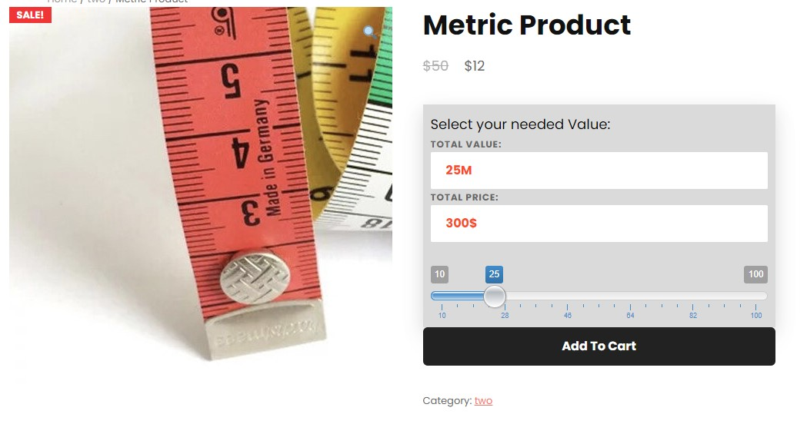

# WooCommerce Product Quantity Slider Plugin

The WooCommerce Product Quantity Slider Plugin adds a user-friendly slider functionality to the product quantity field on WooCommerce product pages. Developed by Morteza Hatami, this plugin enhances the user experience by allowing customers to easily select the desired quantity using a slider.

## Features

- Adds a quantity slider to the product pages in WooCommerce.
- Customizable settings for minimum, maximum, and step values of the slider.
- Choose the product categories where the quantity slider will be applied.
- Automatically updates the total price based on the selected quantity.
- Supports dynamic pricing based on the product price.

## Installation

1. Download the plugin folder and its contents.
2. Upload the entire folder to your WordPress plugins directory.
3. Activate the plugin from the WordPress admin dashboard.

## Settings

Configure the settings for the Quantity Slider Plugin:

1. Go to the WordPress admin dashboard.
2. Navigate to **WooCommerce > Settings > Quantity Slider**.
3. Set the minimum, maximum, and step values for the quantity slider.
4. Enter the slug of the product categories where you want the slider to appear.
5. Save the settings.

## Usage

After activating the plugin and configuring the settings:

1. Visit a WooCommerce product page.
2. If the product belongs to the specified categories, the quantity field will be replaced with a slider.
3. Use the slider to select the desired quantity.
4. The total price will be automatically updated based on the selected quantity.
5. Add the product to the cart.

## Compatibility

This plugin is compatible with WooCommerce and adheres to WordPress coding standards.

## Screenshots

*Fig. 1: The WooCommerce Product Quantity Slider Plugin in action.*

## Contact

For any questions or feedback regarding the plugin, please feel free to reach out to the plugin author:

Name: Morteza Hatami
Email: m.hatami@live.com
Website: [Aram Web](https://aramweb.ir/)
